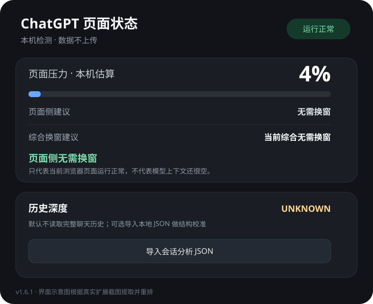
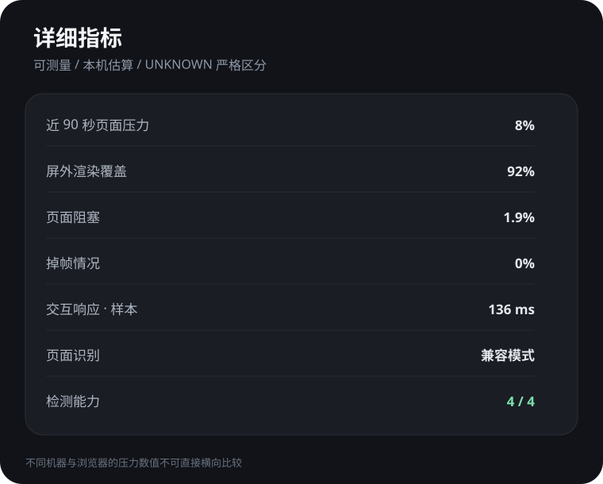

# ChatGPT Page Performance Guard

> 中文产品名：**ChatGPT 页面性能助手**  
> 当前版本：**v1.6.1**  
> 形态：Manifest V3 WebExtension，默认完全本机运行。

一个面向长时间 ChatGPT 网页会话的轻量浏览器扩展：观察页面侧性能压力、减少屏外历史消息的渲染开销，并在证据足够时给出“是否该换新窗口”的页面侧建议。

**它不是 token 计数器，也不会把浏览器压力伪装成模型上下文占用率。** 无法从公开、可验证数据得出的信息会明确显示 `UNKNOWN`。

> 本项目不是 OpenAI 官方产品，与 OpenAI 无隶属、赞助或背书关系。ChatGPT 是 OpenAI 的商标。

## 界面预览

> 下图根据真实扩展截图提取关键区域并重新排版，便于 README 阅读；不是逐像素复刻。

<table>
<tr>
<td width="50%"></td>
<td width="50%"></td>
</tr>
</table>

## 它解决什么问题

超长聊天窗口变卡，通常不是一个单变量问题。页面 DOM 数量、浏览器当前负载、主线程阻塞、动画帧延迟、交互响应、后台程序、上传/工具执行都会影响体感。与此同时，网页端并没有提供一个可信的“当前模型上下文已经用了多少 token”实时接口。

因此本项目把三个概念严格分开：

1. **页面压力**：根据浏览器本机性能信号计算的工程估算值。
2. **历史深度**：只有用户主动导入结构化会话 JSON 时才估算；默认 `UNKNOWN`。
3. **模型上下文占用**：没有可靠官方实时数据时始终 `UNKNOWN`。

这种设计宁可少报，也不把“看起来像数字”的推测包装成事实。

## 工作原理

### 1. 页面压力：多信号加权，不读聊天正文

扩展在 `chatgpt.com` 的 Content Script 中采集四类页面侧信号：

- **页面阻塞**：优先使用 Long Animation Frame；不支持时回退 Long Task；两者都不可用时为 `UNKNOWN`。
- **掉帧比例**：短时 `requestAnimationFrame` 采样中，帧间隔超过约 33.4ms 记为抖动样本。
- **定时器漂移**：比较预期计时与实际回调时间，观察主线程是否长期繁忙。
- **交互响应样本**：浏览器支持 Event Timing 时，按 `interactionId` 去重并取高分位响应时长。这里不是官方 INP，只作为本机交互样本。

各信号先被归一化为 0–100 的严重度，再按有效信号重新归一化权重：

```text
阻塞严重度        35%
掉帧严重度        20%
定时器漂移        15%
交互响应          30%
```

某一项不可测时，不会拿 `0` 冒充“表现完美”，而是从本轮权重中移除。

### 2. 近 90 秒窗口压力：抑制瞬时尖峰

页面压力会进入约 90 秒的短历史窗口，再组合：

```text
平均压力           55%
P75 压力           20%
高压样本占比       15%
当前加载 DOM 规模   5%
当前瞬时压力        5%
```

DOM 规模只占 5%，因为“浏览器当前加载的对话块”不能代表完整聊天历史。

对于刚打开页面时的短时尖峰、孤立的高负载，本项目会做降权，避免一次上传、一次工具调用或后台抖动就直接提示换窗。

### 3. 换窗状态机：持续高压升级 + 恢复滞回

建议不是简单的 `pressure > X`：

- `normal`：正常使用。
- `heavy`：页面开始变重，继续观察。
- `prepare`：持续偏高，建议准备换窗。
- `switch`：持续高负载，建议换新窗口。
- `urgent`：持续极高负载，强烈建议尽快换窗。
- `sampling` / `transient`：采样不足或短时繁忙，不做过激建议。

升级要求压力持续一段时间；从高等级恢复也需要一段低压时间。这种**滞回**避免建议在阈值附近来回跳。

### 4. 长聊天渲染优化

开启“长聊天优化”后，仅对已识别到的历史消息块添加：

```css
content-visibility: auto;
contain-intrinsic-size: auto 720px;
```

浏览器可以跳过屏外内容的部分布局与绘制工作，需要显示时再恢复渲染。扩展**不会删除、截断或隐藏聊天消息的数据节点**。

主选择器是：

```text
article[data-testid^="conversation-turn-"]
```

如果 ChatGPT DOM 结构变化，会降级到 `[data-message-author-role]`；再识别不到则只监控性能，不冒险修改未知结构。

### 5. 可选历史深度校准

用户可以主动导入：

- OpenAI 官方 `conversations.json`；
- 单会话 JSON；
- `CHATGPT_CONTEXT_BRIDGE` JSON。

解析只发生在当前浏览器进程内存中，不上传、不持久化。多会话官方导出必须能按当前 conversation ID 精确匹配，否则 Fail-Closed，不猜“哪个最像”。

历史深度目前采用工程阈值：

| 深度 | 结构化消息 | 工具消息 |
| --- | ---: | ---: |
| 较浅 | `< 250` | `< 100` |
| 中等 | `250–699` | `100–299` |
| 较深 | `700–1499` | `300–699` |
| 很深 | `>= 1500` | `>= 700` |

这些阈值**不是 OpenAI 官方 token 阈值**，只用于判断“这个会话结构是不是已经很深”。

## 隐私与安全模型

v1.6.1 的默认运行面刻意很窄：

- 只匹配 `https://chatgpt.com/*`。
- Manifest 不声明 `permissions` 或 `host_permissions`。
- 无后台 Service Worker。
- 不调用 `fetch` / XHR / WebSocket / EventSource。
- 不使用 Cookie API。
- 不使用 `localStorage` / `sessionStorage` / IndexedDB / `chrome.storage`。
- 不使用 `eval` 或 `new Function`。
- 不上传遥测。
- 导入 JSON 只在内存中解析，刷新页面后校准状态消失。

需要明确的是：Content Script 为了检测 DOM 结构，技术上能够读取匹配页面的 DOM。安全保证来自**源码最小化、无联网路径、自动安全测试和可审计发布包**，而不是“完全没有页面访问能力”这种不准确宣传。

更多见 [security.md](docs/security.md)。

## 浏览器 / 系统兼容性

| 环境 | 状态 | 说明 |
| --- | --- | --- |
| Chrome / Edge / Brave 等 Chromium（Windows） | ✅ 一级支持 | 当前主要实测目标 |
| Chromium（macOS / Linux） | ✅ 预期兼容 | 无 OS 专属 API；仍建议按目标浏览器实测 |
| Firefox Desktop | 🟡 源码兼容 | v1.6.1 已兼容 `browser.*`；正式 AMO 签名还需 Firefox 专用 manifest 元数据 |
| Safari macOS | 🟡 需单独打包 | WebExtension 源码可作为输入，但需 Apple 的 Safari Web Extension packager / Xcode |
| Firefox Android / Safari iOS | ⚪ 未宣称支持 | 尚未做触屏、移动布局及商店分发验收 |

`content-visibility` 已进入较新的跨浏览器基线，但旧浏览器可能不支持；Long Animation Frame 仍不是所有主流浏览器都有，因此代码会运行时检测支持情况并降级。详见 [docs/compatibility.md](docs/compatibility.md)。

## 安装

### Chromium：开发者模式安装

1. 下载 Release 中的 `chatgpt-page-perf-guard-v1.6.1-install.zip`。
2. 解压到一个固定目录。Release ZIP 的根目录直接包含扩展运行文件；仓库中的对应源文件位于 `extension/`，打包时归档其内部内容，不要把 `extension/` 目录再包一层。
3. 打开 `chrome://extensions/` 或 `edge://extensions/`。
4. 开启“开发者模式”。
5. 选择“加载已解压的扩展程序”，指向解压目录。
6. 打开或刷新 `https://chatgpt.com/`。

### Firefox：临时测试

源码逻辑已经兼容 `browser.*`。在 `about:debugging` 可以做开发测试；如果要通过 AMO 正式发布/签名，需要补充 Firefox 专用 `browser_specific_settings.gecko.id` 和数据收集声明，见兼容文档。

### Safari

Safari 分发不是把 Chromium ZIP 直接拖进去。需要在 macOS 上使用 Apple 提供的 Safari Web Extension packager 生成 Xcode 工程，再完成签名和发布。

## 从源码验证

测试只依赖 Node.js 内置测试框架，不需要第三方 npm 包：

```bash
npm test
npm run check
```

当前测试覆盖：

- 历史资产数 `UNKNOWN` 不得被错误变成 `0`；
- `PerformanceObserver` 不存在时安全降级；
- `browser.*` / `chrome.*` 命名空间兼容；
- Manifest 最小权限约束；
- 禁止联网、持久化存储、动态代码和 Cookie API 的静态安全守卫；
- 版本号一致性。

## 项目结构

```text
.
├── .gitignore
├── README.md
├── LICENSE
├── CHANGELOG.md
├── package.json
├── extension/
│   ├── manifest.json    # MV3 清单
│   ├── core.js           # 压力计算、状态机、历史 JSON 解析
│   ├── monitor.js        # 页面采样、DOM 识别、消息接口
│   ├── styles.css        # 屏外历史消息渲染优化
│   └── popup.html/js/css  # 扩展面板
├── docs/
│   ├── architecture.md
│   ├── compatibility.md
│   ├── release-checklist.md
│   ├── security.md
│   └── images/
└── tests/                # Node 内置测试
```

## 已知限制

- ChatGPT DOM 不是稳定公共 API，页面结构变化可能让选择器降级或失效。
- 页面压力受整机负载影响，不是聊天长度的纯函数。
- Performance Timeline 的 entry type 支持因浏览器而异；缺失信号会被标为不可测，而不是伪造为 0。
- 官方会话导出的内部 schema 将来可能变化，解析器必须持续防御性维护。
- “历史深度”是结构工程量，不等于模型实际上下文占用。
- 扩展不能知道模型服务端实际裁剪了哪些上下文。

## 发布策略

版本遵循 SemVer。每次发布前必须：版本号一致、CHANGELOG 已更新、测试全绿、JS 语法检查通过、安全守卫通过、安装 ZIP 只包含运行所需文件、SHA-256 已记录。详细清单见 [docs/release-checklist.md](docs/release-checklist.md)。

v1.6.1 建议作为首个公开 **Pre-release**，在 Chrome/Edge/Firefox 实机收集兼容证据后再决定 Stable。

## License

MIT，见 [LICENSE](LICENSE)。
